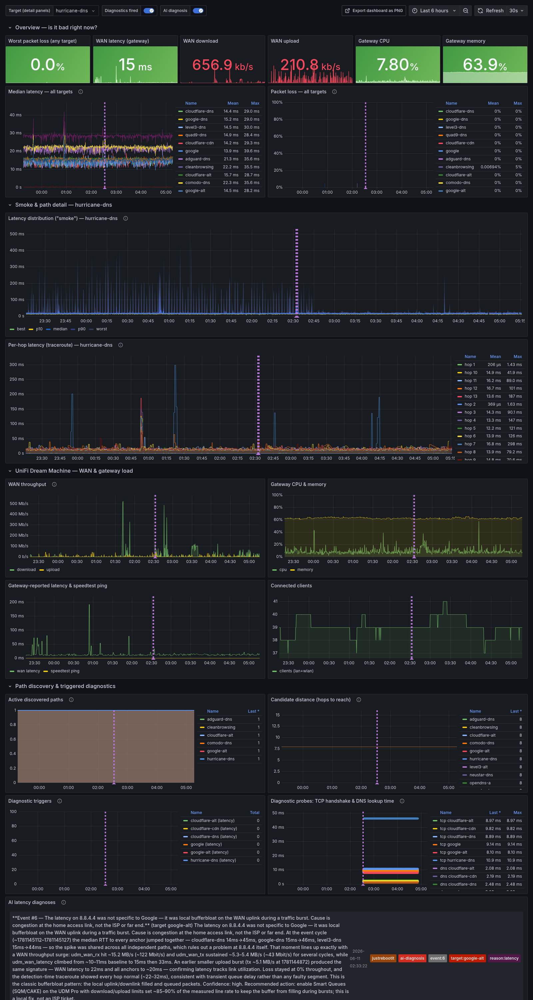

# JustRebootIt

A self-contained, Dockerized recorder for **intermittent home-internet latency
spikes** — the kind where everything feels fine until a video call freezes for
three seconds, and by the time you run a speed test it's gone.

It continuously measures latency, jitter and packet loss to a spread of diverse
targets (your gateway, your ISP, and well-run public anchors), traces the
network path to find *where* the latency lives, and — if you have a **UniFi
Dream Machine Pro** — correlates all of that against WAN throughput and gateway
load. Everything lands on **one Grafana dashboard** designed to be screenshotted
or link-shared with a network engineer at your ISP (e.g. Comcast).

The probes are written in Go and run fully in parallel, so dozens of targets are
measured on a tight cycle without the prober itself becoming the bottleneck.



> **A real diagnosis from the dashboard above (Event #6):** *"The latency on
> 8.8.4.4 was not specific to Google — it was local bufferbloat on the WAN uplink
> during a traffic burst… the median RTT to every anchor jumped together, so the
> spike was shared across all independent paths… `udm_wan_rx` hit ~15.2 MB/s and
> WAN latency climbed from ~10–11ms baseline to 33ms. This is the classic
> bufferbloat pattern: the local uplink filled and queued packets. Confidence:
> high. Recommended action: enable Smart Queues (SQM/CAKE) on the UDM Pro with
> limits ~85–90% of the measured line rate — this is a local fix, not an ISP
> ticket."* — written automatically by the AI analysis when the event fired.

```
                 ┌─────────────┐     ICMP ping + traceroute
                 │   prober    │────────────────────────────►  many targets
                 │   (Go)      │                                (gateway, ISP, anchors)
                 └──────┬──────┘
                        │ /metrics
   UniFi Dream   ┌──────┴──────┐
   Machine Pro ─►│ udm-exporter│  WAN throughput, gateway CPU/mem,
       (API)     │   (Go)      │  speedtest, client counts
                 └──────┬──────┘
                        │ /metrics
                 ┌──────┴──────┐        ┌─────────────┐
                 │ prometheus  │───────►│   grafana   │  http://localhost:3000
                 │  (90d TSDB) │        │ (1 dashboard)│  → lands on the dashboard
                 └─────────────┘        └─────────────┘
```

## Quick start

```sh
git clone <this repo> && cd JustRebootIt
cp .env.example .env
$EDITOR .env                 # set UDM_URL / UDM_USERNAME / UDM_PASSWORD
$EDITOR config/targets.yml   # set your home-gateway IP (and ISP, if not Comcast)
docker compose up -d --build
```

Then open **http://localhost:3000** — you land straight on the **Home Internet
Latency** dashboard, no login required. That's it.

> Just want the latency graphs and don't have a UniFi gateway? See
> [Running without a UDM](#running-without-a-udm).

## What you need to do on the UniFi Dream Machine Pro

A one-time, ~2-minute setup:

1. **Create a local admin account.** In UniFi OS go to **Settings → Admins &
   Users → Add Admin**, and choose **"Restrict to local access only"**. Do *not*
   use your Ubiquiti cloud (SSO) login — local accounts are more reliable for an
   API client and keep your cloud credentials out of the container.
   - A **Viewer** role is sufficient; the exporter only issues read-only
     `GET /stat/*` calls. Give it full local admin only if you prefer.
2. **Note the gateway URL** — usually `https://192.168.1.1`. Put it, plus the
   username and password, into your `.env` file (`UDM_URL`, `UDM_USERNAME`,
   `UDM_PASSWORD`).
3. **(Optional) Schedule periodic Speed Tests.** UniFi OS → **Network →
   Settings → Internet → Speed Test**. This populates the
   `udm_speedtest_*` panels. WAN latency, throughput, CPU/memory and client
   counts are reported regardless.
4. Nothing else. The UDM presents a self-signed TLS certificate, so the exporter
   skips certificate verification by default (`UDM_INSECURE=true`). You do **not**
   need to install a cert or open any ports on the UDM.

## Network permissions & capabilities

This is the one thing that can't be hand-waved: **measuring latency requires
sending ICMP echo (ping) packets and ICMP traceroutes, which need a raw network
socket.**

- **The prober container is granted the Linux `NET_RAW` capability** in
  `docker-compose.yml`:

  ```yaml
  prober:
    cap_add:
      - NET_RAW
  ```

  This is the *minimum* privilege needed — it lets the process open ICMP sockets
  but grants nothing else. The container does **not** run `--privileged` and runs
  as an unprivileged user inside a distroless image. `NET_RAW` is a default
  Docker capability, so on most hosts this works out of the box; it's listed
  explicitly so the requirement is visible and survives hardened/default-deny
  setups.

- **`privileged: true` in `config/targets.yml`** is unrelated to Docker
  privilege — it tells the *prober* to use raw ICMP sockets (the reliable choice
  given `NET_RAW`) rather than unprivileged datagram-ICMP sockets, which
  additionally require the host sysctl `net.ipv4.ping_group_range` to be set.

- **No inbound ports are required** for probing. The only published port is
  Grafana's **3000** (`ports: ["3000:3000"]`). Prometheus (9090) and the two
  exporters (9430/9431) are reachable only on the internal Docker network.

- **Outbound:** the prober needs to reach the internet (ICMP) and your LAN
  gateway; the udm-exporter needs HTTPS to the UDM on your LAN.

### First-hop / traceroute accuracy (optional)

With the default bridge network, traceroutes show one or two extra
Docker/host hops before reaching your real gateway. The added latency is
sub-millisecond and constant, so it does **not** mask spikes — but if you want
the path to start exactly at your physical gateway, run the prober on the host
network:

```yaml
  prober:
    network_mode: host   # add this; remove its `networks:` block
```

and change the Prometheus scrape target for the `prober` job from `prober:9430`
to `host.docker.internal:9430` (or the host's LAN IP). Most users don't need
this.

### Platform notes

- **Linux:** works as described.
- **macOS / Windows (Docker Desktop):** containers run inside a Linux VM, so
  `NET_RAW` and ICMP work, but the "host" for `network_mode: host` is that VM,
  not your Mac/PC — the bridge default is recommended there.

## Configuration

### Targets — `config/targets.yml`

This file is bind-mounted into the prober, so edits take effect on
`docker compose restart prober`. Each target has a stable `name` (keep it stable
so historical graphs line up), a `host`, a `group`, and an optional `trace`
flag. Groups organize the dashboard and your reasoning:

| group     | meaning                              | what a spike here tells you            |
|-----------|--------------------------------------|----------------------------------------|
| `gateway` | your own router / first hop          | the problem is **inside your house**   |
| `isp`     | your ISP's own infrastructure        | the problem is **your ISP** (show them)|
| `anchor`  | diverse, well-run public anchors     | rules out the far end being at fault   |
| `content` | sites/services you actually use      | real-world impact                      |

The shipped defaults probe your gateway, Comcast's resolvers (`75.75.75.75` /
`75.75.76.76`), and a spread of anchors (Cloudflare, Google, Quad9, Level3).
**Edit at least `home-gateway`** to your gateway's LAN IP. If you're not on
Comcast, swap the `isp` targets for your ISP's gateway/resolver.

Timing knobs (defaults shown) at the top of the file:

```yaml
interval: 10s          # one probe cycle; pings are spread across it
pings: 20              # echo requests per target per cycle (the "smoke")
timeout: 2s            # per-reply timeout (must be < interval)
privileged: true       # raw ICMP sockets (see Network permissions)
trace_interval: 60s    # traceroutes are heavier; run them less often
trace_max_hops: 30
trace_timeout: 2s
```

### Local overrides — `config/overrides.yml` (deploy-safe)

`config/targets.yml` is tracked in the repo, so editing it directly means a
`git pull` (or image rebuild) can clobber your changes. To keep local
customizations safe, drop a **gitignored `config/overrides.yml`** next to it —
the prober auto-loads it and **layers it on top** of the shipped config:

- any scalar/nested field you set **overrides** the default (`pings`,
  `diagnostics.*`, `underload.host`, …);
- the `targets` and `discovery.candidates` lists are **merged by name** — an
  entry whose `name` matches a shipped one **replaces just that target** (e.g.
  point `home-gateway` at your real LAN IP), and a new `name` is **appended**.

You only write what you change; everything else keeps the shipped config (and
picks up future default improvements). Get started from the committed template:

```sh
cp config/overrides.example.yml config/overrides.yml
$EDITOR config/overrides.yml         # set your gateway IP, add your targets
docker compose restart prober
```

The whole `config/` directory is mounted into the prober, so both files are
visible; `overrides.yml` is in `.gitignore`. (You can also point `-overrides` at
an explicit path; the default is a sibling `overrides.yml`, applied only if
present.)

### Path discovery — diverse, short routes (automatic)

Probing a dozen destinations that all leave your house the same way is mostly
redundant: when that shared segment hiccups, *everything* spikes at once and you
learn nothing about *where*. The `discovery:` block fixes this. Periodically it
traces a candidate pool, then promotes a **path-diverse** subset to active
probing — keeping the ones whose **2nd/3rd hops differ** and that **reach their
destination in the fewest hops** (closer targets localize a fault more
precisely). Selected candidates are probed and traced under the group
`discovered`; the always-on `targets` above are never touched.

```yaml
discovery:
  enabled: true
  interval: 15m         # re-trace the pool and re-select this often
  max_targets: 6        # how many diverse paths to actively probe
  max_hops: 8           # short traces during discovery (only early hops matter)
  max_reach_hops: 12    # ignore candidates farther than this
  candidates:
    - { name: cloudflare-alt, host: 1.0.0.1 }
    - { name: opendns-a,      host: 208.67.222.222 }
    # ... a broad pool spanning distinct operators/ASNs
```

Candidate names must be unique and must not collide with the always-on targets.
The dashboard's **Active discovered paths** panel shows which are currently
selected, and **Candidate distance** shows how many hops away each one is.

### Per-hop packet loss & AS boundaries (optional)

A whole class of "it's not me, it's the path" problems — a remote stream or game
stutters while Netflix/YouTube are fine — is **packet loss on a specific
middle-mile path**, which a latency probe can't see. By default (**`trace_probes: 5`**) the prober runs 5
traceroute passes per cycle for each trace-enabled target and publishes **per-hop
loss** (`traceroute_hop_loss_ratio`) — set it to `1` for just a single path
snapshot with no loss data. With **`trace_asn`** on (default), each hop is also
attributed to its **origin AS** (via Team Cymru DNS) and the prober marks
**AS-handoff boundaries** (`traceroute_as_handoff`) — the peering/transit
handoffs where congestion lives. (Per-cycle loss resolution is 1/`trace_probes`,
refined over time by averaging cycles.)

The bottom **"Path packet loss & AS boundaries"** row graphs per-hop loss and
lists the AS path. The one interpretation rule that matters: **loss at a single
mid-path hop that doesn't continue to later hops is just that router
rate-limiting its ICMP replies — ignore it.** Real path loss *persists* across
consecutive hops toward the destination (and shows in the target's own loss
panel). Loss that begins at/after the handoff from your ISP's AS to a transit/peer
AS is the ISP's problem — and now you have the per-hop, per-timestamp,
AS-attributed evidence to escalate it. The AI diagnosis is taught this fingerprint
too, so it stops blaming your LAN for a backbone hop.

### Interconnect congestion — seeing into the middle mile

Middle-mile congestion lives at the **peering/transit borders** where one network
hands off to the next, and a single-endpoint test can't see it. With
**`border`** probing on (default), after each trace the prober pings the **near
side** (last hop in one AS) and the **far side** (first hop in the next) of every
AS-handoff boundary on the path. Plotted over time in the **"Interconnect
congestion"** panels, a far-minus-near delay that **inflates at peak hours** —
often with far-side loss — is a congested interconnect: the evidence you take to
your ISP. This is a lightweight take on CAIDA's Time-Series Latency Probing
(TSLP). It needs `trace_asn` on (that's what finds the boundaries).

### Triggered diagnostics — deeper tests during a spike

Intermittent problems are usually gone before you can react. The
`diagnostics:` block watches every probe cycle and, the moment a target looks
anomalous, fires a burst of deeper tests automatically — capturing evidence
while the problem is still happening:

- a **fresh traceroute** (a path snapshot taken *during* the event);
- a **TCP handshake time** to the target — because many ISPs deprioritize ICMP,
  this proves whether *real* traffic is affected, not just pings; and
- a **DNS resolution time** — slow lookups masquerade as "the internet is slow".

A run fires when a cycle's median RTT exceeds the target's rolling baseline by
both a factor and an absolute margin (so neither tiny jitter nor a small
relative bump alone trips it), or when loss crosses a threshold — debounced by a
cooldown so a sustained event triggers once, not every cycle.

```yaml
diagnostics:
  enabled: true
  latency_factor: 3.0       # trigger when median > 3x the rolling baseline
  latency_abs_margin: 30ms  # ...and at least 30ms above it
  loss_threshold: 0.1       # or when loss >= 10%
  cooldown: 60s             # at most one run per target per minute
  baseline_alpha: 0.2       # EWMA smoothing for the "normal latency" baseline
  tcp_port: 443             # handshake port for the TCP latency test
  dns_probe: www.google.com # name resolved & timed during a run
  workers: 2                # concurrent diagnostic runs
```

Every trigger also drops a **red annotation** across the whole dashboard, so you
can line up exactly when deeper tests fired against the latency and WAN graphs.

### Latency under load — the bufferbloat / streaming-stutter probe (optional)

A normal ping measures the link while it is **idle** — which is exactly when
bufferbloat is invisible. Streaming stutter (Plex, video calls, cloud gaming)
happens only while the link is **saturated**: a bulk transfer fills an oversized
buffer, every other packet queues behind it, and round-trip time jumps from a
few milliseconds to hundreds. A quiet-link ping sails right past it.

The `underload:` block recreates that condition on purpose. It briefly
saturates the link with a controlled transfer while pinging a stable host, then
publishes the **idle-vs-loaded RTT difference — the bufferbloat — as a metric**
you can graph over time ("every Plex session, the uplink hit 90% and RTT to the
client tripled"). The increase is graded on the same A–F scale the
Waveform/DSLReports bufferbloat tests use, and a bad grade also drops a
dashboard annotation.

It moves **real data**, so it is **off by default** and bounded by a byte
ceiling and a short duration per run. Pick the direction that matches your
problem:

- **`up`** — saturate the uplink. The usual culprit for a Plex **server**
  pushing video (residential cable uplinks buffer the worst), or any
  upload-heavy stutter.
- **`down`** — saturate the downlink. For a Plex **client** / download-heavy
  stutter.
- **`both`** — measure each direction in turn.

```yaml
underload:
  enabled: false       # opt-in: this generates real traffic
  interval: 15m        # how often to run a loaded-latency test
  target: uplink       # metric label (independent of the targets list)
  host: 1.1.1.1        # pinged under load; a near anchor isolates YOUR link
  direction: up        # up | down | both
  duration: 12s        # how long to hold the link under load per direction
  streams: 4           # parallel transfer connections (enough to saturate)
  bytes: 250000000     # ceiling on data moved per direction per run (~250MB)
  pings: 20            # RTT samples in each of the idle and loaded phases
  timeout: 2s
  bad_increase: 60ms   # annotate when loaded RTT rises >= this (0 = never)
  down_url: https://speed.cloudflare.com/__down  # defaults: Cloudflare's
  up_url:   https://speed.cloudflare.com/__up     # public speed-test endpoints
```

There's also a **"Run a bufferbloat test on an IP"** button on the dashboard:
enter any IP (e.g. your Plex peer's public IP), pick a direction, and it runs a
one-off latency-under-load test against that host on demand — no config edit
needed. The button **waits for the test to finish (~10–25s) and shows a success
notification with the result**, so you get immediate feedback; the idle-vs-loaded
RTT and grade also land in the **"Last on-demand test"** panels beside it and as
a timeline annotation. It works even when the scheduled probe is off
(`enabled: false`); the `underload.manual` block gates and rate-limits it. The
request is proxied server-side through Grafana to the prober, so no prober port
is exposed. (If a click seems to do nothing, see Troubleshooting — the prober
logs every request.)

The fix for a bad grade is almost always **SQM / Smart Queues** (cake or
fq_codel) on the offending end — it caps the link slightly below line rate to
keep the queue short — **not** a faster plan. Point `host` at a near anchor (or
your gateway) to measure *your own* access link's queue; point it at the
stream's far end to measure that whole path. Published metrics:
`underload_rtt_idle_seconds`, `underload_rtt_loaded_seconds`,
`underload_rtt_increase_seconds`, `underload_bufferbloat_ratio`,
`underload_throughput_bits_per_second`, and `underload_loaded_loss_ratio`
(all labelled by `target` and `direction`).

### AI root-cause analysis — "why did this happen?" (optional)

The mechanical diagnostics gather raw signal; this turns it into an explanation.
When an event fires, a **Claude agent** investigates it and writes a
plain-language root cause onto the dashboard. It's given read-only tools and
decides how to use them:

- **query Prometheus** — to see whether the spike hit *every* target at once
  (upstream/ISP) or just one path, and whether it lined up with the WAN
  saturating (bufferbloat);
- **traceroute / DNS lookup** — to re-probe the path and resolution *now*;
- **RDAP lookup** — to name the operator/ASN that owns a slow or lossy hop (so a
  bad segment gets attributed to Comcast vs. a transit provider).

Each event gets a **monotonic Event #N** (also exported as
`diagnostic_event_id{target}`), and the agent's writeup is posted as a numbered,
tagged **Grafana annotation**. They appear as purple markers on the timeline and
in the **"AI latency diagnoses"** panel at the bottom of the dashboard — so every
spike, its diagnostic run, and its explanation line up by number.

**This is fully optional and off by default.** It activates only when you set an
API key:

```sh
# in .env
ANTHROPIC_API_KEY=sk-ant-...
```

With no key, the prober simply skips the analysis — everything else works
unchanged. Tunables live under `diagnostics.ai` in `config/targets.yml`:

```yaml
diagnostics:
  ai:
    enabled: true
    model: claude-opus-4-8   # set claude-sonnet-4-6 for cheaper, faster analysis
    max_iterations: 12       # cap on the agent's tool-use loop per event
```

Two things to know before enabling it:

- **It sends event telemetry to the Anthropic API** — your traceroute hops, IP
  addresses, and ISP identity are part of what the agent reasons over. Don't
  enable it if that's not acceptable.
- **It costs per investigation.** Opus is the default for best diagnosis; switch
  `model` to `claude-sonnet-4-6` to cut cost.

**Use a local model (no cost, no data leaves your network).** Point the agent at
any Anthropic-compatible endpoint by setting `ANTHROPIC_BASE_URL` in `.env` (e.g.
a local LLM proxy on your LAN). With it set, no `ANTHROPIC_API_KEY` is required
and investigations cost nothing. Leave it blank to use the hosted Anthropic API.

**Cost control — investigations are coalesced.** A single shared incident (e.g.
bufferbloat) spikes *every* target at once, which would otherwise launch dozens
of identical investigations. To prevent that, each event gets a cheap
**signature** (`reason` + whether it's a *shared* cross-target incident or an
*isolated* path), and:

- the **first** event of a signature gets a full investigation; **repeats within
  `repeat_ttl`** (default 1h) reuse that analysis with **no API call**;
- a single shared incident collapses to one signature once **`shared_threshold`**
  targets trip within **`shared_window`** — one investigation, not one per target;
- a global **`min_interval`** (default 3m) and **`daily_budget`** (default 50)
  cap spend even across distinct signatures;
- **isolated distant problems are skipped entirely.** A target reached in more
  than **`far_hops`** (default 3) that acts up *while every other path stays
  healthy* is "far" — a single remote IP spiking or going dark isn't *our*
  internet problem — so with **`skip_far`** on (default) it takes **no API call
  at all** (counted as `exogenous` in `diagnostic_ai_suppressed_total`); the red
  trigger marker still records it on the timeline. Set `skip_far: false` to
  investigate far problems anyway (with the cheaper model and a `far_repeat_ttl`
  reuse window of 12h instead of the normal `repeat_ttl`).

**Cheap vs. expensive model, learned per problem.** With **`model_eval`** on
(default), each problem *class* (`reason` + shared/near/far) is evaluated: its
first **`eval_samples`** (default 3) events run **both** `model` (Opus) and
`model_cheap` (Sonnet), and a tiny judge call decides whether the cheaper one
reached the same root cause. Once a majority agree, the class **locks in the
cheaper model**; otherwise it keeps the expensive one. **Far problems that are
investigated at all** (i.e. when `skip_far: false`) **always use the cheap
model** (no eval). Set `model_eval: false` to just use Opus for near/shared and
Sonnet for far. Which model ran each investigation is in
`diagnostic_ai_model_used_total{model}`.

**Prompt caching cuts the per-investigation token cost.** The system prompt and
tool list are byte-stable across events, so they're cached once and *read* (at
~0.1× price) on every iteration of an investigation's tool-use loop; the growing
conversation is cached incrementally too, so a 12-step investigation re-reads its
earlier tool results instead of reprocessing them. A 1-hour cache TTL keeps that
prefix warm across investigations spaced up to an hour apart. Each investigation
logs its token breakdown (`tokens input=… cache_read=… cache_write=… output=…`)
so you can confirm `cache_read` dominates — if it's persistently 0, something is
invalidating the cached prefix. (Note: caches are per-model, so the `model_eval`
A/B phase pays a separate cache write for each of the two models until a class
settles on one.)

Every trigger is still recorded (`diagnostic_triggered_total`, the red markers),
so nothing is hidden — only the *paid investigations* are deduplicated. Reused /
throttled events are counted in `diagnostic_ai_suppressed_total{reason}`. Tune
the knobs under `diagnostics.ai` in `config/targets.yml`.

**Each incident is tagged with its LLM accounting.** An investigated event's
annotation carries `llm_used`, `model:<id>`, `tokens:<n>`, `llm_cache_hit` or
`llm_cache_miss`, and `model_eval` (when both models ran), plus a `[model · n
tokens · cache state]` footer. Events that did *not* call the LLM (reused,
exogenous, rate-limited, budget) get a lightweight `llm_not_used` annotation with
the reason, surfaced in the **"Events with no LLM call"** panel at the bottom —
these are rate-limited so a storm can't flood the dashboard (the full count
stays in `diagnostic_ai_suppressed_total`). The bottom **"AI investigation
cost"** row graphs `diagnostic_ai_tokens_total` by model and by kind, so you can
watch spend and confirm `cache_read` dominates.

The agent posts annotations using the Grafana admin account
(`GRAFANA_ADMIN_PASSWORD` from `.env`) over the internal Docker network; no
ports are exposed for this.

### On-demand investigation — the "take a look" button

The AI analysis above fires automatically on anomalies. You can also trigger it
yourself: the **"Ask the AI to take a look"** panel (in the "$target" detail row)
runs the same agentic investigation **on demand** for the currently selected
target, then posts its writeup as an annotation just like an automatic event.
Unlike the automatic path it always investigates (no coalescing) and skips the
cheap-vs-expensive eval, so you get a full answer to *"how am I doing versus
baseline right now?"*. The writeup appears on the timeline and in the "AI latency
diagnoses" panel ~30–90s after you click (not in the button panel itself).

It needs no exposed prober port: the button (a **Business Forms** panel) sends
its request through the **Infinity** datasource, which Grafana proxies
**server-side** to the prober over the internal network. The Infinity datasource
is locked to the prober host only (`allowedHosts`), so an anonymous dashboard
viewer can't turn it into a general request proxy. Both plugins install
automatically via `GF_INSTALL_PLUGINS` in `docker-compose.yml`.

Because each click makes an LLM call and runs active probes — and the dashboard
allows anonymous viewing — manual runs are **rate-limited**:

```yaml
diagnostics:
  manual:
    enabled: true
    min_interval: 60s   # min time between manual runs (0 = unlimited)
    daily_cap: 20       # max manual runs per 24h (0 = unlimited)
```

Throttled clicks return `429` and are counted in
`diagnostic_ai_suppressed_total{reason="manual-throttled"}`. With a local model
(`ANTHROPIC_BASE_URL`, above) there's no per-click cost and the limits are just a
safety net.

### Secrets / Grafana — `.env`

See `.env.example`. The `.env` file holds your UDM password and is gitignored.
Grafana defaults to anonymous, login-free viewing so the stack is zero-click and
the dashboard is easy to link-share; set `GRAFANA_ANON_ENABLED=false` and
`GRAFANA_DISABLE_LOGIN=false` if you ever expose it beyond your trusted LAN.

## Reading the dashboard

The dashboard (**Home Internet Latency**) is built to be read top to bottom and
shared as-is:

1. **Overview** — at-a-glance status tiles: worst packet loss, gateway WAN
   latency, WAN up/down throughput, gateway CPU/memory. Red = bad right now.
2. **Median latency / Packet loss — all targets** — the diagnosis row:
   - Spikes on **every** target at once → upstream (your ISP / WAN).
   - Spikes on **one** target only → that specific path.
   - Loss to your **gateway** → inside the house; loss to anchors but *not* the
     gateway → the ISP.
3. **Smoke (per target)** — pick a target in the **Target** dropdown. The shaded
   band is the spread from best to worst ping in each cycle (jitter); the inner
   band is p10–p90; the bold line is the median. A wide band with a flat median
   means the connection is jittery even when "average" latency looks fine — a
   classic call-quality killer.
4. **Per-hop latency (traceroute)** — which hop is the *first* to spike owns the
   problem. Hover a hop to see the router address (useful to hand to your ISP).
5. **UniFi Dream Machine** — WAN throughput, gateway CPU/memory, gateway-reported
   latency/speedtest, client counts, all on the same time axis. If latency
   spikes line up with the WAN maxing out, that's **congestion/bufferbloat**, not
   an ISP fault — fix it with QoS/Smart Queues rather than a support ticket.
6. **Path discovery & triggered diagnostics** — which diverse paths are currently
   active, how far away each candidate is, when deeper diagnostics fired, and the
   TCP-handshake / DNS-lookup times they captured. **Red annotations** across the
   whole dashboard mark each diagnostic trigger, so you can align "deeper tests
   fired here" with the latency and WAN graphs above.
7. **AI latency diagnoses** *(if enabled)* — the Claude agent's numbered,
   plain-language root cause for each event. Purple annotations mark them on the
   timeline; the panel lists the writeups. Empty unless `ANTHROPIC_API_KEY` is set.

**Sharing with your ISP:** select the time window around an incident, take a
screenshot of the median-latency and traceroute panels (and the WAN-throughput
panel to pre-empt "you were just using it heavily"), or — since viewing is
anonymous — send them the Grafana link if they're on your network/VPN. The stack
includes the **Grafana image renderer**, so you can export clean PNGs
server-side instead of taking manual screenshots:

- **Whole dashboard** → the **"Export dashboard as PNG"** link in the dashboard's
  top-right bar renders the entire board (current time range + selected target)
  to a single PNG in a new tab; right-click → Save, or send the link.
- **A single panel** → its menu → **Share → Direct link rendered image**.

(The full-dashboard render uses a fixed `height=3600` in the link URL
(`docker/grafana/dashboards/latency.json`). If you add rows and the bottom gets
cut off, raise it — and keep `RENDERING_VIEWPORT_MAX_HEIGHT` on the `renderer`
service in `docker-compose.yml` at or above that value, or the renderer clamps it.)

## Metrics reference

Prober (`:9430/metrics`):

| metric | meaning |
|---|---|
| `probe_up{target,group}` | 1 if the last cycle got at least one reply |
| `probe_loss_ratio{target,group}` | fraction of packets lost, last cycle |
| `probe_rtt_best/worst/median/mean/stddev_seconds` | per-cycle RTT summary |
| `probe_rtt_percentile_seconds{percentile}` | p10/p25/p75/p90 for the smoke band |
| `probe_packets_sent_total` / `probe_packets_received_total` | counters |
| `traceroute_hop_rtt_seconds{target,group,ttl}` | RTT to the router at each hop |
| `traceroute_hop_info{target,ttl,addr}` | the router address seen at each hop |
| `traceroute_hop_loss_ratio{target,group,ttl,addr,asn,as_name}` | per-hop packet loss over a multi-pass trace (`trace_probes > 1`); labels carry each hop's address and origin AS |
| `traceroute_as_handoff{target,ttl,from_asn,to_asn}` | 1 at a TTL (hop) where the path crosses an AS boundary |
| `traceroute_border_rtt_seconds{target,from_asn,to_asn,side,addr}` | RTT to the near/far side of an AS-handoff boundary (TSLP interconnect probe); far minus near, rising at peak, = congested interconnect |
| `traceroute_border_loss_ratio{target,from_asn,to_asn,side,addr}` | packet loss to each side of an AS-handoff boundary |
| `traceroute_path_length` / `traceroute_reached` | path length / reached dest |
| `discovery_selected{target}` | 1 if the candidate is currently promoted to active probing |
| `discovery_reach_hops{target}` / `discovery_reached{target}` | candidate distance / reachability |
| `diagnostic_triggered_total{target,reason}` | count of latency/loss-triggered diagnostic runs |
| `diagnostic_tcp_connect_seconds{target}` / `_up` | TCP handshake time / success from the last run |
| `diagnostic_dns_lookup_seconds{target}` / `_up` | DNS resolution time / success from the last run |
| `diagnostic_event_id{target}` | id of the most recent event (maps annotation ↔ run) |
| `diagnostic_ai_analyzed_total{target}` / `diagnostic_ai_failed_total{target}` | AI analyses completed / failed |
| `diagnostic_ai_suppressed_total{reason}` | events that reused a prior analysis or were throttled (repeat/rate-limited/budget/manual-throttled) |
| `diagnostic_ai_model_used_total{model}` | investigations by the model that produced the analysis |
| `diagnostic_ai_eval_runs_total` | dual-model evaluation runs (cheap vs expensive + judge) |
| `diagnostic_ai_tokens_total{model,kind}` | AI tokens by model and kind (input/cache_read/cache_write/output) — powers the "AI investigation cost" graphs |
| `underload_rtt_idle_seconds{target,direction}` / `_loaded_seconds` | median RTT idle vs under load, last latency-under-load run |
| `underload_rtt_increase_seconds{target,direction}` | loaded − idle median RTT (the bufferbloat) |
| `underload_bufferbloat_ratio{target,direction}` | loaded median RTT as a multiple of idle |
| `underload_throughput_bits_per_second{target,direction}` | throughput achieved while saturating the link |
| `underload_loaded_loss_ratio{target,direction}` | packet loss to the host while the link was saturated |

UDM exporter (`:9431/metrics`): `udm_up`, `udm_wan_latency_ms`,
`udm_wan_rx_bytes_per_second`, `udm_wan_tx_bytes_per_second`, `udm_wan_drops`,
`udm_speedtest_{download,upload}_mbps`, `udm_speedtest_ping_ms`,
`udm_gateway_cpu_percent`, `udm_gateway_memory_percent`,
`udm_gateway_uptime_seconds`, `udm_clients`, `udm_config_change_total`.

## Gateway config awareness & change events

The udm-exporter also reads the gateway's **WAN configuration** (Smart Queues /
SQM, rate limits, WAN type, MTU — with secrets like PPPoE passwords redacted)
and uses it two ways:

- It serves that config at `/config`, which the **AI analysis reads** via a
  `udm_config` tool. This stops the classic "the AI keeps telling me to enable
  Smart Queues, but I already did" problem — the agent checks what's actually
  configured first, and instead reasons about whether the *configured* shaper
  rate is set too high for the real line, or whether the cause is elsewhere.
  The agent's prompt is also grounded in real **bufferbloat rules** so it
  doesn't loop on "lower the upload cap": it must confirm a direction was
  actually **saturated** during the spike (else it's not bufferbloat), it knows
  there's a **floor** (~85–90% of line rate — below that, lowering the cap only
  wastes bandwidth, so it won't recommend it), and it knows the UDM Pro can't
  shape a gigabit download (Smart Queues disables hardware offload and is
  CPU-bound to a few hundred Mbps). Give it your specifics with
  **`diagnostics.ai.context`** in `config/targets.yml` (your plan's line rates,
  gateway model, and what's already configured) so it computes "90% of your 35
  Mbps upload" exactly and stops re-recommending a fix that's already in place.
- It **watches that config for changes** (every `UDM_CONFIG_INTERVAL`, default
  5m). When a setting changes, it posts an orange **config-change annotation**
  to Grafana describing exactly what changed (`wan_smartq_enabled: false → true`)
  and bumps `udm_config_change_total`. Those show up on the timeline and in the
  **"UDM config changes"** panel — so you can see whether enabling SQM (or any
  tweak) actually moved latency, and a change made just before a spike becomes a
  prime suspect.

This needs the exporter to reach Grafana (it uses `GRAFANA_URL` /
`GRAFANA_ADMIN_PASSWORD` over the internal network) — already wired in
`docker-compose.yml`. The redacted config is what's sent to the AI; if even that
is too much to share, leave `ANTHROPIC_API_KEY` unset (the change annotations
still work without it).

## Running without a UDM

The latency probing is fully independent of the UniFi exporter. To run just the
probes + dashboard, comment out the `udm-exporter` service in
`docker-compose.yml` (the UDM panels will simply show "No data"), or leave it —
it will log auth failures and report `udm_up 0` without affecting anything else.

## Troubleshooting

- **All targets show `probe_up 0` / "socket: permission denied" in
  `docker compose logs prober`** → the container didn't get `NET_RAW`. Confirm
  the `cap_add: [NET_RAW]` block is present and your Docker host/policy allows
  it. As a fallback you can set `privileged: false` in `targets.yml` *and* set
  `net.ipv4.ping_group_range="0 2147483647"` on the host.
- **`udm_up 0`** → check `docker compose logs udm-exporter`. Usual causes: wrong
  `UDM_URL`, a cloud (SSO) account instead of a local one, or a wrong
  password/role.
- **Gateway target times out but the internet works** → your gateway may rate-
  limit or drop ICMP to itself; point `home-gateway` at its LAN IP and confirm it
  answers `ping`.
- **Dashboard empty for a minute after startup** → normal; Prometheus needs a
  scrape cycle or two before the first points appear.
- **"Active discovered paths" is empty** → discovery uses the same raw-ICMP
  traceroutes as everything else, so it needs `NET_RAW` (see above). It also only
  runs its first pass at startup and then every `discovery.interval`; give it a
  moment. With no `candidates` configured it stays dormant by design.
- **The dashboard doesn't reflect a `git pull` / dashboard edit** → the dashboard
  is provisioned from `docker/grafana/dashboards/latency.json` as the source of
  truth and re-scanned every 30s, so changes normally appear within a minute. If
  it's stuck on an old version, restart Grafana to force a re-import:
  `docker compose restart grafana` (or `docker compose up -d --force-recreate
  grafana`). Because the file is authoritative, panel edits made in the Grafana
  UI are not persisted — change the JSON instead.
- **The "Run a bufferbloat test" button doesn't seem to do anything** → the
  button now *waits* for the test (~10–25s) and shows a success notification with
  the result, but if you're unsure it's running, the prober logs every request:

  ```sh
  docker compose logs -f prober | grep -i underload
  ```

  You should see `manual underload request ... host="..."` the instant you click,
  then `manual underload ... running synchronously`, then the result line
  (`underload <host>/<dir>: idle=... loaded=... grade ...`). If you see the
  request line with `host=""`, the form didn't send the IP; if you see no request
  line at all, the click didn't reach the prober. You can test the endpoint
  directly, bypassing the form, from the Grafana container:

  ```sh
  docker compose exec grafana wget -qO- --header 'Content-Type: application/json' \
    --post-data '{"host":"1.1.1.1","direction":"down"}' \
    http://prober:9430/api/underload
  ```

  It returns the result JSON (grade, idle/loaded ms, throughput) directly.

## Development

```sh
make test     # go test ./...
make vet
make build    # local binaries into ./bin
make up       # docker compose up -d --build
```

Layout: `cmd/prober` and `cmd/udmexporter` are the two binaries (one image, two
entrypoints); `internal/{config,pinger,tracer,metrics,udm,discovery,diag,aidiag,grafana}`
hold the logic; `docker/` holds Prometheus + Grafana provisioning and the
dashboard JSON.

## License

[MIT](LICENSE) © 2026 Adam Fletcher.
